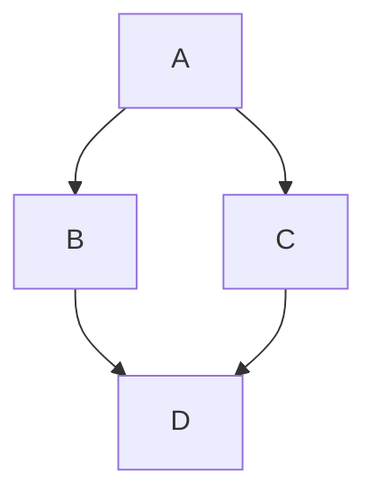
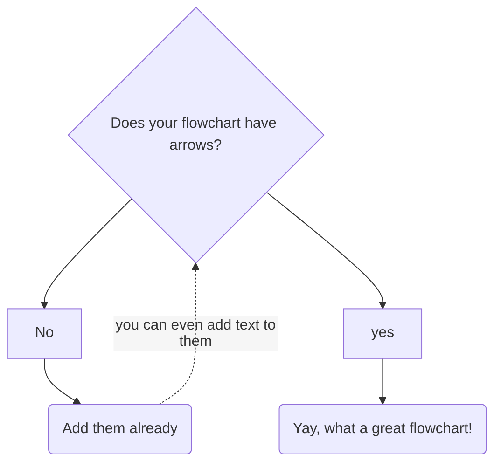
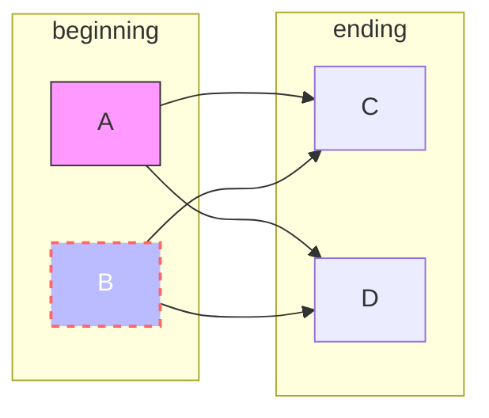

# Figures

```{r, cars, fig.cap="A scatterplot.", echo=FALSE}
plot(cars)
```

```{r, fig.cap=c("hello", "bye"), echo=FALSE, fig.retina=1}
plot(1:10)
cat('\n\n')
hist(rnorm(1000))
```


<!---->


<!---->


<!---->
