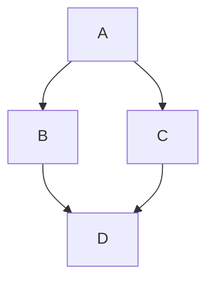
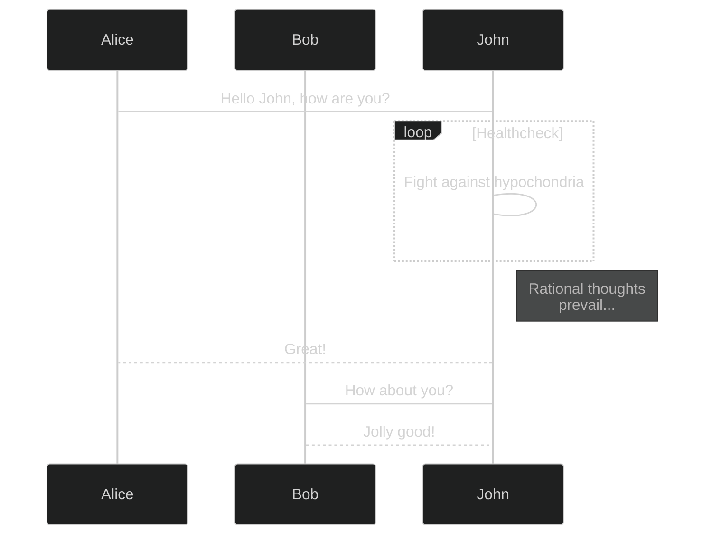
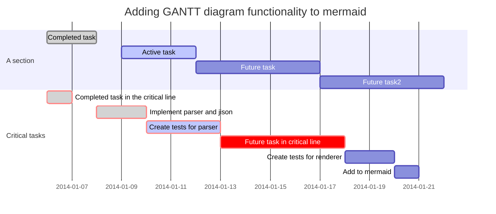

# In the morning

## Getting up

- Turn off alarm
- Get out of bed

## Breakfast

- Eat eggs
- ~~Drink coffee~~

# In the afternoon

## Working


***

> a *lot* of work
>
> and **even** more
>
> **and _even_** more

## Lunch

```perl
use v5.28;
use strict;
use warnings FATAL => qw(utf8);

our $VERSION = 1;
exit 42;
```

## Some diagrams 1


<!---->

## Incremental bullets

>- Sandwich
>- Drink tea
>- one at a time (incrementally)

## Some diagrams 2

<!-- https://mermaid-js.github.io/mermaid/#/directives?id=directives -->

<!---->

## Some diagrams 3


<!---->

# In the evening

## Dinner

| Order  |   Food    | Price of the food |
|--------|:---------:|------------------:|
| First  | Spaghetti |              10 € |
| Second |   Wine    |              20 € |

## Going to sleep

- Get in bed ^1^...~2~
- Count sheep 2---4
