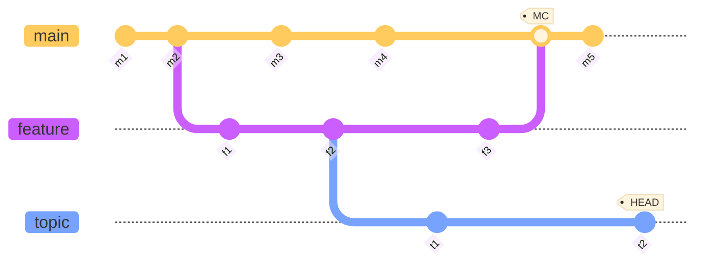

# Git

## References

## Links

[Rebase](rebase)
[Search](search)
[Plumbing](plumbing)

### RefLog Shortnames

```bash
git reflog
734713b HEAD@{0}: commit: fixed refs handling, added gc auto, updated
d921970 HEAD@{1}: merge phedders/rdocs: Merge made by recursive.
1c002dd HEAD@{2}: commit: added some blame and merge stuff
```

```bash
git show main@{yesterday}
```

```bash
git show :/some-text-to-search-in-commit-message
```

### Ancestry References

- previous commit

```bash
git show HEAD^
git show HEAD~
```

- the second parent of d921970 (useful for merge commits)

```bash
git show d921970^2
```

- deeper history

```bash
git show HEAD~3
git show HEAD^^^
```

### Commit Ranges

- all commits reachable by feature that aren’t reachable by main (difference: feature \ main)

```bash
git log main..feature
git log feature ^main
git log feature --not main
git log feature bugfix ^main
git log feature bugfix --not main
```

- commits reachable from feature and main but not common (symmetric difference: feature Δ main)

```bash
git log main...feature
git log --left-right main feature --not $(git merge-base --all main feature)
git log --left-right main...featrure
```

## Log

- Show commits in ours branch but not in theirs

```bash
git log theirs..ours
```

## Conflict resolve

- Resolve conflict using the changes from the target branch (main)

```bash
git checkout --ours -- path/file
```

- Resolve conflict using the changes from the working branch (feature)

```bash
git checkout --theirs -- path/file
```

## examples


