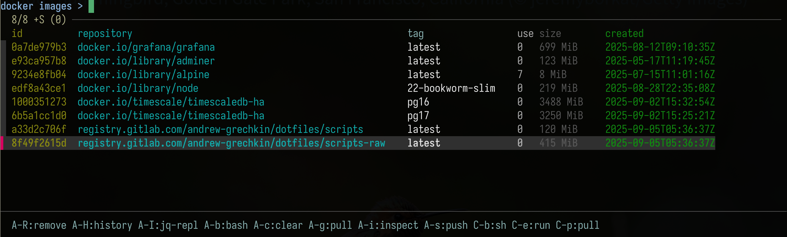
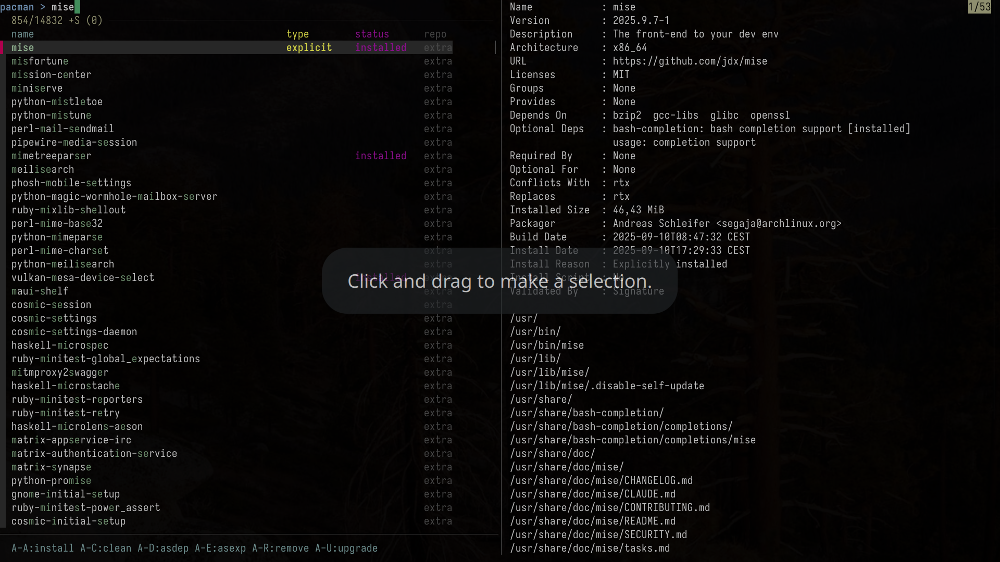

# Dotfiles

This repository contains my personal dotfiles for configuring a Linux environment. It's a collection of configuration files, scripts, and settings that I use to customize my development and desktop experience.

## Structure

The repository is organized as follows:

*   **`.config/`**: Contains configuration files for various applications that follow the XDG Base Directory Specification.
*   **`.local/`**: Contains local user-specific files, including scripts in `.local/script`.
*   **`.gnupg/`**: Configuration for GnuPG.
*   **`.ssh/`**: Configuration for SSH.
*   **`hooks/`**: Git hooks that are automatically installed and used in this repository.
*   **`submodules/`**: Git submodules.
*   **`.bashrc`, `.zshenv`, `.zshrc`, etc.**: Shell configuration files.
*   **`setup`**: A script to help set up the dotfiles.

## Software Covered

This repository includes configurations for a wide range of software, including but not to:

*   **Window Manager**: `bspwm`
*   **Shell**: `zsh`, `bash`, `tmux`
*   **Editors**: `neovim`, `vim`
*   **Development Tools**: `git`, `docker`, `npm`, `perl`, `python`
*   **Terminal Utilities**: `eza`, `fd`, `fzf`, `htop`, `ripgrep`
*   **And many more...**

## A Philosophy of Tooling

This repository contains a suite of custom command-line tools designed to augment and streamline a developer's daily workflow. They are built on a consistent philosophy: that the command line can be as interactive, powerful, and user-friendly as a graphical application, without sacrificing script-ability or the Unix principle of composition.

### The Core Philosophy: MVC on the Command Line

Nearly every interactive tool in this collection is built on a three-mode architectural pattern that mirrors the classic Model-View-Controller (MVC) design:

1.  **The Model (The JSON API):** Every tool can act as its own API backend. When invoked with a `-j` or `--json` flag, it outputs pure, structured JSON data. This is the single source of truth, containing all the necessary information but no presentation logic.

2.  **The View (The TUI and Text Renders):** The tool has two primary "views" for this data:
    * **The Interactive TUI:** When run in a terminal, the tool uses the JSON model to populate a powerful, `fzf`-based Terminal User Interface. This view is for exploration, interaction, and performing actions.
    * **The Static Text Table:** When its output is piped, the tool renders the JSON model into a clean, colorized, and human-readable table. This view is for quick, non-interactive checks.

3.  **The Controller (The `fzf` Bindings):** User input is handled by `fzf`'s powerful key-binding system. These bindings are the "controller" logic, taking user actions, invoking underlying commands (like `git`, `docker`, or `mise`), and telling the view to reload its data from the model.

This separation of concerns is the guiding principle here. It allows to make tools much more powerful and maintainable that are a pleasure to use both interactively and in automated scripts.

## The Ecosystem

### The Git Suite: A Terminal-Based IDE

This is a complete, interconnected system for managing Git repositories, designed to replace disparate commands with a single, fluid workflow.

* `fzf-git-files`: The top-level entry point. A file navigator for every file tracked by Git. From here, you can dive into the history of any file.
* `fzf-git-file-show-history`: The file historian. It takes a file path and displays its entire commit history, allowing for deep analysis like blaming a commit or viewing the file's contents at a specific point in time.
* `fzf-git-log`: The history surgeon. This is a powerful tool for manipulating commit history through interactive rebase and rewriting. It is integrated with AI for suggesting commit messages.
* `fzf-git-x-status`: The staging ground. A replacement for `git status` that allows for interactive staging, unstaging, and committing, including advanced `fixup!` commits.
* `git-x-amend`: A super-powered `git commit --amend` wrapper that intelligently preserves dates during a rebase and can invoke AI to generate commit messages.

### The Tool & Environment Managers

* `menu-mise`: A TUI for the `mise` tool manager. It provides a single interface to search, install, remove, and set global versions of any tool, abstracting away the underlying `mise` commands.
* `menu-mpv-history`: A history manager for the `mpv` media player. It not only displays playback history but actively cleans and deduplicates the history file on every run, ensuring it remains tidy.
* many more...

### The Credential & API Tools

This suite automates the complex and tedious process of handling authentication tokens for command-line tools.

* `cred`: A meta-credential helper that sits on top of Git's credential system. It can rewrite URLs to use central SSO providers and automatically approves credential caching, solving common corporate authentication challenges.
* `git-credential-oidc-vault` & such: Specialized, interactive credential helpers that perform full browser-based login flows (OIDC, custom SSO) to acquire tokens from scratch. They feature a minimalist, embedded web server to catch the redirect from the authentication provider.
* `bear`: A generic "credential injector." It fetches a token using `cred` and replaces placeholders like `%TOKEN%` or `%BEARER%` in a given command. Its polymorphic design (e.g., `bear-gitlab`, `bear-github`) makes it trivial to authenticate `curl` requests to common services.

### The Data & Filter Utilities

* `jq-repl`: An interactive REPL for building and testing `jq` filters. It provides live feedback as you type, transforming `jq` from a batch tool into an exploratory one. Implemented purely in `fzf`.
* `json2table`: A flexible and powerful script that converts a JSON stream into a colorized, aligned table. It uses a simple `key;value;color` syntax for defining columns and is the backbone of the static text "View" in the MVC pattern.
* `color.bash`: The foundational color library. It provides a clean, function-based interface for adding color to shell scripts, enabling the polished look and feel of the entire ecosystem.
* many more...

## Screenshots

Here are some screenshots of the tools in action:

### Docker images TUI

To discover, pull, push inspect images and run containers



### Pacman TUI

This help discover and manage packages on Arch linux



## Installation

To use these dotfiles, you can clone this repository and then symlink the desired configuration files to your home directory.

For example, to symlink the `.bashrc` file:

```bash
ln -s /path/to/dotfiles/.bashrc ~/.bashrc
```

The `setup` script in the root of the repository can be used to automate this process.

## License

This project is licensed under the terms of the LICENSE file.
