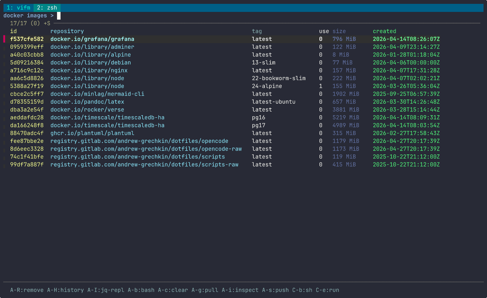
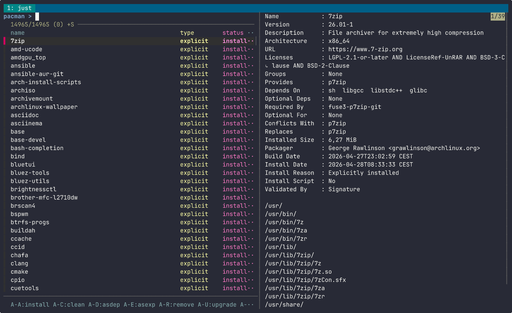

# Dotfiles

This repository contains my personal dotfiles for configuring a Linux environment. It's a collection of configuration
files, scripts, and settings that I use to customize my development and desktop experience.

Over the years this repository has outgrown initial dotfiles idea and has become quite sophisticated (in a good way IMO)
development ecosystem.

## Manifesto (Core Design Principles Influencing Any Repository I Create)

1. Unix philosophy is the cornerstone
2. The Unix pipeline remains the most powerful (yet neglected) tool in the toolbox
3. Don't reinvent the wheel: leverage and extend existing solutions
4. Everything is a Data API: JSON (or other structured textual data) first
5. Declarative UIs built on top of CLI data models, not as a replacement for them
6. Compress complexity: prefer simple over easy
7. Eliminate all friction: prefer convention over configuration
8. A stable and portable toolchain is superior to a trendy one
9. Those who drink the water must remember those who dug the well

## Recordings

Here are some brief recordings of the tools in action:

### [Docker images TUI](.local/scripts/tui/docker-images)

To discover, pull, push inspect images and run containers



### [Pacman TUI](.local/scripts/tui/menu-pacman)

This help discover and manage packages on Arch Linux



## Structure

The repository is organized as follows:

- **`.config/`**: Contains configuration files for various applications that follow the XDG Base Directory Specification.
- **`.local/`**: Contains local user-specific files, including scripts in `.local/scripts`.
- **`.gnupg/`**: Configuration for GnuPG.
- **`.ssh/`**: Configuration for SSH.
- **`hooks/`**: Git hooks that are automatically installed and used in this repository.
- **`submodules/`**: Git submodules.
- **`.bashrc`, `.zshenv`, `.zshrc`, etc.**: Shell configuration files.
- **`setup`**: A script to help set up the dotfiles.

## Software Covered

This repository includes configurations for a wide range of software, including but not limited to:

- **Window Manager**: `bspwm`
- **Shell**: `zsh`, `bash`, `tmux`
- **Editors**: `neovim`, `vim`
- **Development Tools**: `git`, `docker`, `npm`, `perl`
- **Terminal Utilities**: `eza`, `fd`, `fzf`, `htop`, `ripgrep`
- **And many more...**

## A Philosophy of Tooling

This repository contains a suite of custom command-line tools designed to augment and streamline a developer's daily
workflow. They are built on a consistent philosophy: that the command line can be as interactive, powerful, and
user-friendly as a graphical application, without sacrificing scriptability or the Unix principle of composition.

### The Core Philosophy: MVC on the Command Line

Nearly every interactive tool in this collection is built on a three-mode architectural pattern that mirrors the classic
Model-View-Controller (MVC) design:

1.  **The Model (The JSON API):** Every tool can act as its own API backend. When invoked with a `-j` or `--json` flag,
    or with `model` command, it outputs pure JSON data. This is the single source of truth, containing all the necessary
    information but no presentation logic.
2.  **The View (The TUI and Text Renders):** The tool has two primary "views" for this data:
    - **The Interactive TUI:** When run in a terminal, the tool uses the JSON model to populate a powerful, `fzf`-based
      Terminal User Interface. This view is for exploration, interaction, and performing actions.
    - **The Static Text Table:** When its output is piped, the tool renders the JSON model into a clean, colorized, and
      human-readable table. This view is for quick, non-interactive checks.

3.  **The Controller (The `fzf` Bindings):** User input is handled by `fzf`'s key-binding system. These bindings are the
    "controller" logic, taking user actions, invoking underlying commands, and telling the view to reload its data from
    the model.

This separation of concerns is the guiding principle here. It allows for making tools much more powerful and
maintainable that are a pleasure to use both interactively and in automated scripts.

## The Ecosystem

### Security & Infrastructure: The Trusted Root

This suite ensures the developer environment is secure, hardware-backed, and automated across machines.

- [yk]: A comprehensive management suite for Yubikey devices. It automates complex PIV provisioning, Certificate
  Authority (CA) setup, and SSH resident key management.
- [cred]: A meta-credential helper that sits on top of Git's credential system. It can rewrite URLs to use central SSO
  providers and automatically approves credential caching.
- [bear]: A generic "credential injector." It fetches tokens via `cred` and injects them into commands (e.g., `curl`),
  making it trivial to authenticate requests without exposing secrets in history.

### The Unix Pipeline & Data Tools

These tools reinforce the Unix philosophy by making pipelines more powerful, reliable, and observable.

- [jq-repl]: An interactive JQ processor with live preview. It allows for rapid prototyping of complex JSON filters with
  a "dump-to-clipboard" workflow.
- [memoize]: A transparent caching wrapper that stores command output and returns it instantly on subsequent calls,
  provided the environment is unchanged.
- [tap]: A pipeline debugger that executes commands for each line of stdin while passing the original data through,
  allowing for side-effect actions (like logging) without breaking the pipe.
- [spew]: A serializer for parallel pipelines. It buffers input from concurrent processes and uses locking to ensure
  output is written to the next stage without interleaving.

**The Modern Pipeline in Action:**

By combining the JSON-first model with the Unix pipeline, complex operations become trivial, stateless, and instantly
composable. For example:

```bash
http-echo -r | json2yaml | colored-yaml
```

This single line receives http requests data, emits them as a stream in JSON format, transforms the JSON into
human-readable YAML, and colorizes it for the terminal until it's terminated.

### The Git Suite: A Terminal-Based IDE

A complete, interconnected system for managing Git repositories, designed for a fluid, TUI-driven workflow.

- `fzf-git-files`: The top-level entry point. A file navigator for every file tracked by Git.
- `fzf-git-x-blame`: The file historian. Displays entire commit history, allowing for deep analysis and point-in-time
  content viewing.
- [git-x-amend]: A super-powered `commit --amend` wrapper that preserves dates during rebases and can invoke AI for
  message generation.
- many more...

### Tool & Environment Managers

TUI dashboards that provide high-level management for system packages and development tools.

- [menu-pacman]: A TUI for the `pacman` package manager on Arch Linux. Provides an interactive interface for discovering
  and managing system packages.
- [menu-mise]: A TUI for the `mise` tool manager to search, install, and manage global tool versions.
- [menu-mpv-history]: A history manager for `mpv` that actively cleans and deduplicates playback history on every run.
- many more...

## Installation

To use these dotfiles, you can clone this repository and then symlink the desired configuration files to your home
directory.

For example, to symlink the `.bashrc` file:

```bash
ln -s ~/dotfiles/.bashrc ~/.bashrc
```

The [setup] script in the root of the repository can be used to automate this process.

## License

This project is licensed under the GNU General Public License Version 3 (GPLv3).
See the `LICENSE` file for details.

[bear]: .local/scripts/tool/bear
[cred]: .local/scripts/tool/cred
[git-x-amend]: .local/scripts/tool/git-x-amend
[jq-repl]: .local/scripts/tui/jq-repl
[memoize]: .local/scripts/tool/memoize
[menu-mise]: .local/scripts/tui/menu-mise
[menu-mpv-history]: .local/scripts/tui/menu-mpv-history
[menu-pacman]: .local/scripts/tui/menu-pacman
[setup]: setup
[spew]: .local/scripts/filter/spew
[tap]: .local/scripts/filter/tap
[yk]: .local/scripts/tool/yk
